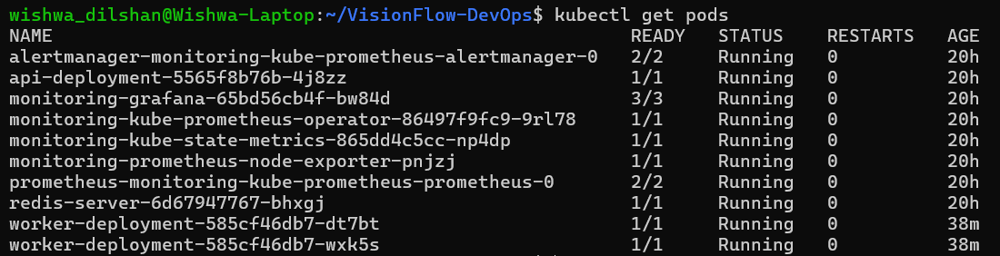
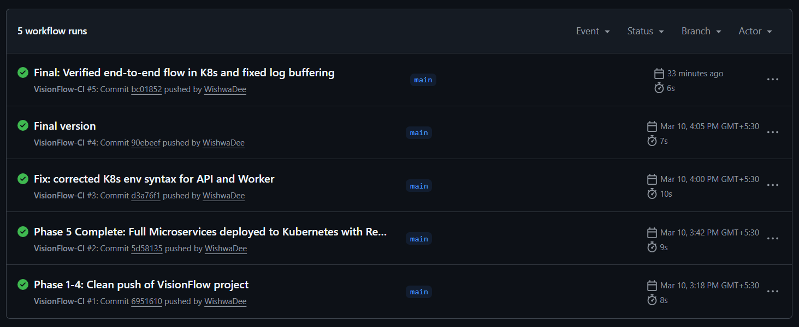
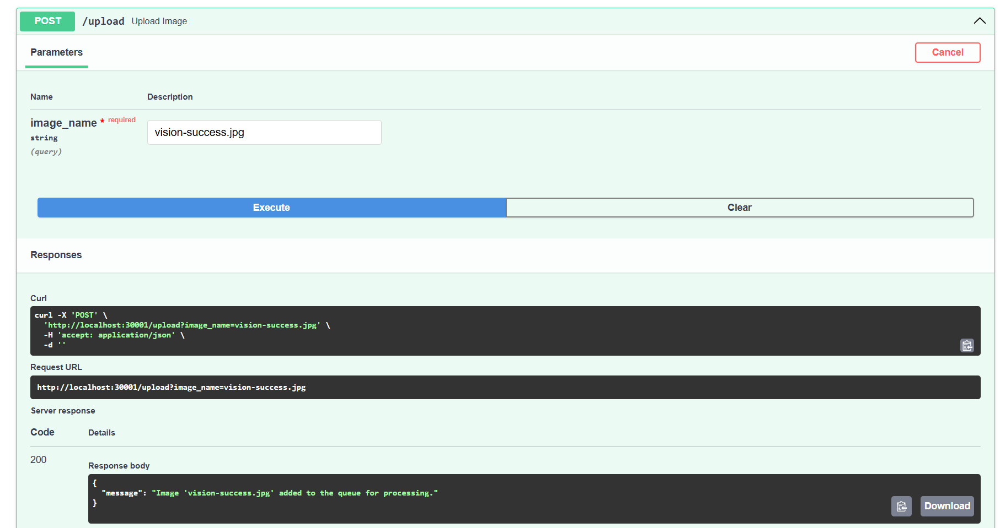
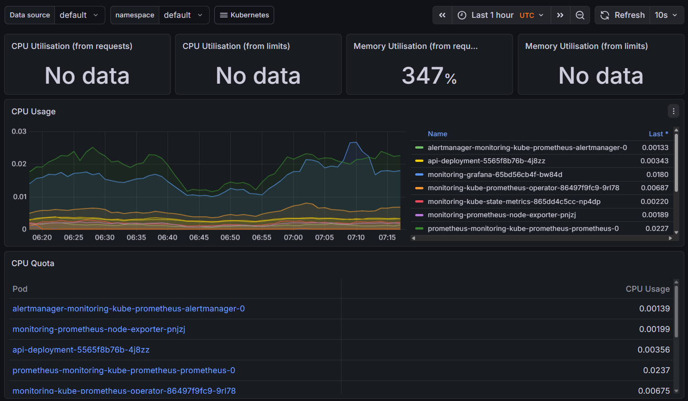
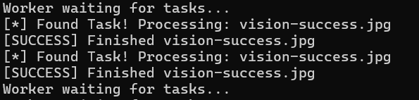

# VisionFlow: Cloud-Native Image Processing Pipeline

VisionFlow is an end-to-end DevOps project featuring a microservices architecture. It demonstrates the complete lifecycle of a modern application from local development to production-grade orchestration.

## 🛠 Tech Stack
- **Backend:** Python (FastAPI), Redis
- **Containerization:** Docker & Docker Compose
- **Infrastructure:** Terraform & LocalStack (AWS S3 Simulation)
- **CI/CD:** GitHub Actions
- **Orchestration:** Kubernetes (Kind Cluster)
- **Observability:** Prometheus & Grafana (Helm Charts)

## 🚀 Key Features
- **Microservices Architecture:** Decoupled API and Worker services.
- **Infrastructure as Code (IaC):** Automated cloud resource provisioning.
- **CI/CD Automation:** Fully automated testing and build pipeline.
- **High Availability:** Scalable worker deployments in Kubernetes.

## 📸 System Overview (Screenshots)

### 1. Kubernetes Infrastructure

*All services (API, Worker, Redis, and Monitoring) running successfully in the Kind cluster.*

### 2. CI/CD Pipeline (GitHub Actions)

*Automated builds and tests passing on every push.*

### 3. API Interface (Swagger UI)

*Interactive API documentation powered by FastAPI, used for triggering image processing tasks.*

### 4. Monitoring Dashboard (Grafana)

*Real-time observability and resource monitoring of the cluster.*

### 5. Application Flow & Logs

*Live logs showing the Worker service processing image tasks asynchronously.*

---

## 🏗 Setup & Installation
1. **Clone the repo:** `git clone https://github.com/WishwaDee/VisionFlow-DevOps.git`
2. **Infrastructure:** `cd terraform && terraform apply`
3. **Run with Docker:** `docker compose up --build`
4. **Deploy to K8s:** `kubectl apply -f k8s/`